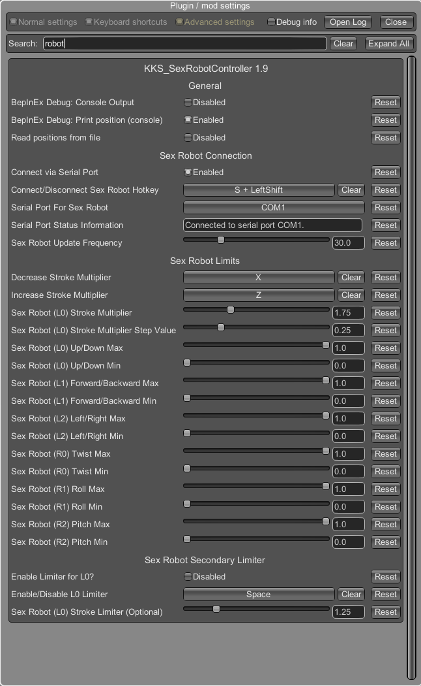

# Koikatsu Sunshine Sex Robot Controller Plugin
## General information

**How to install the Plugin?**

Go to the directory where your game is installed: `<GameDir>\BepinEx\plugins` and create a new folder called `KKS_SexRobotController`. Add the `KKS_SexRobotController.dll` to this folder.

### Disclosure
The code base used to develop this plugin is the code for the `HS2_SexRobotController` from hs2robotics (https://github.com/hs2robotics/HS2_SexRobotController).

### About the Plugin
This plugin outputs the positional data from a total of 100 (currently) of the 'HScenes' (sex scenes) in Honey Select 2 with full 6 degrees of freedom (6DOF) in a simple text format known as T-Code (Toy-Code) which is then sent over a serial link (COM port) to drive an open source sex robot (OSR2, OSR2+, SR6, etc).

The 6 total degrees of freedom are:
- L0 (X) Up/Down
- L1 (Y) Forward/Backward
- L2 (Z) Left/Right
- R0 (RX) Twist
- R1 (RY) Roll
- R2 (RZ) Pitch

The male's penis in a given HScene is always aligned with the L0 (X) Up/Down axis, and depending on the HScene/animation in Honey Select 2, 3+ specific 'bones' of the female's vagina, anus, breasts, mouth, or hands are used to calculate and export the necessary 6DOF information to drive the sex robot.

The T-Code format and open source sex robots (OSR2, OSR2+, SR6) were all created/developed by TempestVR. You can find the full/free open sourced OSR2 here: https://www.patreon.com/posts/osr2-1-year-47041804.

**EroScripts**
For more info, check out the discussion thread on EroScripts: 
https://discuss.eroscripts.com/t/illusion-honey-select-2-and-koikatsu-sunshine-sr6-bepinex-plugin/315180.

## KKS_SexRobotController v2.0
Access the BepinEx Plugin Menu by pressing `F1`and clicking the `Plugin Settings` button. 


### General and Serial Connection Section
- `BepinEx Debug Console Output`: Enables additional logging which will be printed to the console (if enabled). The content will also be written to log (if BepinEx Log is enabled)
- `Read animations from file?`: Reads animations from file, allowing for animations not included in the plugin to be used (e.g. for non-English versions of the game). 
- `Write animation names to file?`: Writes unknown animations to a file.
- `Connect via Serial Port`: Enables or disables the active connection via Serial Port
- `Serial Port for Sex Robot`: List of COM Ports, select the one which the Sex Robot is connected to.
- `Serial Port Status Information`: Shows the current status for the Serial Port connection.
- `Sex Robot Update Frequency`: How often the Sex Robot should be updated (can be left with the set default value)

#### Adding animations/positions to file
When enabling the option to read from file, a file which contains the known animations/positions will be created (`SexRobotController.txt`). The file is only created if it doesn't exists to serve as a template, you can delete everything in the file if you want to. However, the file with this name must be present for your positions to be read. The animations are divided into positions (i.e. what body part should be tracked). One of these values must be used in the pairing.

- ORAL
- BREASTS
- LEFTHAND / RIGHTHAND
- INTERCRURAL
- VAGINAL
- ANAL
- LEFTFOOT / RIGHTFOOT

Threesome:
- ORALSWAP
- BREASTSWAP
- LEFTHANDSWAP / RIGHTHANDSWAP
- INTERCRURALSWAP
- VAGINALSWAP
- LEFTFOOTSWAP / RIGHTFOOTSWAP

As can be seen in the file, these are in the format:
```
<animationName>, <bodypart>
```

Some examples:
```
Handjob, LEFTHAND
Blowjob, ORAL
Titjob, BREASTS
Missionary, VAGINAL
```

This need to be a match with the list above, if not there will be no movement.
For example, if the right hand is used in a handjob and the left hand is set to be tracked, there will be no movement, since the part tracked isn't moving.
Animations that aren't listed/known can be printed in the terminal, hence why I recommend first enabling the BepInEx Logging (`Plugin settings -> BepInEx -> Logging.Disk -> Enabled`).

For HS2, all the "Foreplay (Receiving)" are not included, the same is true for KKS.

You don't need to restart the game to use the newly added animations, but you do need to execute the following steps to load the recently added animations:
1. Open the Plugin settings and for the SexRobotController, disable and then re-enable the `Read animations from file` option.
2. Select a different animation to read the content from file (the content of the file is read once, on animation change).

Here is an example of how an error could look like, if an invalid value was added (in this example, the value `INVALID` was set for the body part, which doesn't exist).

```
[Info   :HS2_SexRobotController] Error updating Animation dictionary: System.ArgumentException: Requested value 'INVALID' was not found.
  at HS2_SexRobotController.FileHandler.readPositionsFromFile () [0x0007c] in <ca2677a8d684461c82753f125094d4f9>:0
  at HS2_SexRobotController.CheckButtonAndSerialConnState () [0x0001a] in <ca2677a8d684461c82753f125094d4f9>:0
```
The error can be found in the BepInEx Log (found in `<GameDir>\BepInEx`) for errors.

#### Writing animations to file
This option writes animation names, which isn't present in the Plugin to a separate file (`SRC_UnknownAnimations.txt`). Although most, if not all, available animations should be present in the Plugin, the games I have uses mixed languages for the animation names (in Honey Select 2, all animations are in English. In KKS, its mixed between English and Japanese). Therefore, to make it easier for those with a non-English version to add those animations which are missing, this option was included.

**Note:** 
The animation name doesn't contain any position info and is not written to the file which can be read by the plugin. The animation(s) needs to be added manually to the the file `SexRobotController.txt`.

### Sex Robot (L0) Section
These controls the Stroke movement (L0). The multipliers extends the potential movement length to make animations with shorter movements "feel" longer. As the section names implies, the `Service` is used for all service animations and insertion for vaginal and anal. The sex animations are divided into three main loop types: Weak, Strong, Orgasm. Additionally, there's Idle (meaning no sex animation is playing) and Climax (the actual orgasm). These slider allows you to increase or decrease the strenght of the movement along the L0-Axis based on the current stage/state the animation is at.

### Sex Robot: Min/Max Values Section
These values, as the name implies, sets the minimum and maximum value for the given Axis. A value of 0 and 1 means the entire Axis range can be used (100% movement range). Whereas if the minimum is set to 0 and maximum to 0.5, only half the movement range of the given Axis will be used. My recommendation is to not change these, unless the movement range is too wide/long.

## KKS_SexRobotcontroller v1.9
Due to the changes made between the v1.9 and v2.0 I've decided to keep the explanation along with the screenshot for this plugin version. This section only details that which is no longer present in v2.0.

**BepinEx Plugin Menu**


To get the names of animations that the Plugin doesn't include, you need to enable the option  `BepInEx Debug: Print position (console)`. In KKS, an additional idle animation name will be printed: `立ち愛撫` (this is only printed when starting the H-Scene and can be ignored).

**Settings Menu (appears after H-Scene has started)*


The following options allows for connecting or disconnecting the robot. It also includes a button for enabling or disabling the `Speed limiter` (switching between which speed multiplier should be used for `L0`).


**Separate button (within the Clothing menu) for enabling or disabling the speed limiter.**


